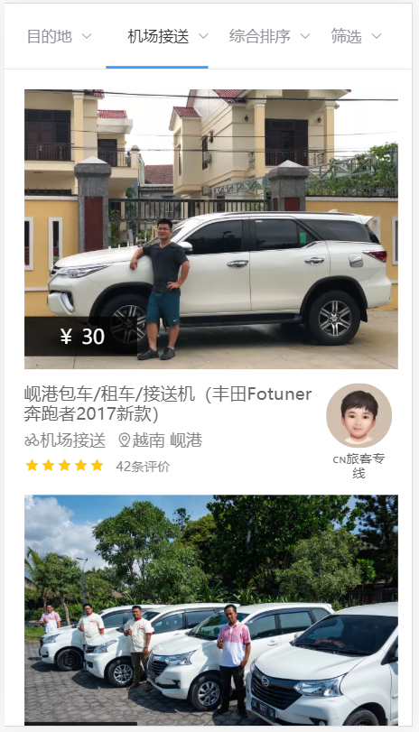

# 项目名称：八只小猪

#### 官网
https://h5.8pig.com/

#### 上线网址

http://47.98.245.185:7777

#### 后台管理系统地址

http://47.98.245.185:8339

#### 仓库地址

git@github.com:gzh51907/eight-pigs.git

## 使用技术与框架

Vue、Vue-Router、Vue-Cli、Vuex、Nodejs、ElementUI、git，还有express、axios、multer等各种插件

## 项目总体框架


## 团队分工

组长：钟国威

成员：沈显燕、夏玉龙

#### 负责模块说明

###### 钟国威：

- 搭建项目脚手架、安装基本的插件
- 负责用nodejs搭建后台服务器，并且写好接口
- 爬取数据并且保存到本地mongodb数据库
- 完成列表页的样式以及各种功能
- 完成详情页的样式以及各种功能
- 编写后台管理系统的添加信息页面(可以上传图片)和编辑信息页面以及删除功能

###### 沈显燕：

- 完成首页的样式以及各种功能
- 编写路由的配置，实现底部导航栏跳转
- 完成发现页的样式以及功能
- 完成了后台管理系统的登录/注册功能
- 完成了后台管理系统的路由跳转以及首页的样式
- 完成了后台管理系统的列表页、用户信息页的样式以及功能

###### 夏玉龙：

- 完成了“我的”页面的样式以及功能
- 实现了注册功能
- 实现了登录功能（包含短信验证）
- 使用了全局路由守卫来设置权限（登录后才能访问购物车）
- 完成了订单页的样式以及功能

## 项目页面截图

##### 首页：


##### 列表页：




##### 详情页：


##### 我的：


## 目录结构

###### 8pigs-APP/src :

```
│  App.vue
│  main.js
│  ww.json
│
├─assets
│  │  logo.png
│  │
│  ├─css
│  │      base.css
│  │      normalize.css
│  │
│  └─imgs --- 爬下来的图片
│
├─components
│  │  HelloWorld.vue
│  │
│  ├─common --- 封装的组件
│  │  ├─navbar
│  │  │      NavBar.vue
│  │  │
│  │  ├─scroll
│  │  │      Scroll.vue
│  │  │
│  │  ├─swiper
│  │  │      index.js
│  │  │      Swiper.vue
│  │  │      SwiperItem.vue
│  │  │
│  │  ├─tabbar
│  │  │      TabBar.vue
│  │  │      TabBarItem.vue
│  │  │
│  │  └─usetools
│  │          UseTools.vue
│  │          UseToolsItem.vue
│  │
│  └─content --- 封装的组件
│      ├─backtop
│      │      BackTop.vue
│      │
│      ├─goods
│      │      GoodsList.vue
│      │      GoodsListItem.vue
│      │
│      ├─mainTabbar
│      │      MainTabBar.vue
│      │
│      ├─scrolly
│      │      ScrollY.vue
│      │
│      └─TabContent
│              TabContent.vue
│
├─img
│      love.png
│      order.png
│      umbrella.png
│
├─network 
│      discover.js
│      home.js
│      index.js
│
├─pages --- 跳转的页面
│  │  Custom.vue
│  │  List.vue
│  │  List2.vue
│  │  Login.vue
│  │  register.vue
│  │  XQ.vue
│  │  XQ2.vue
│  │
│  ├─detail
│  │      Detail.vue
│  │
│  ├─discover
│  │  │  Discover.vue
│  │  │
│  │  └─childComps
│  │          DiscoverFresh.vue
│  │          DiscoverGlobal.vue
│  │          DiscoverNav.vue
│  │          DiscoverTourMan.vue
│  │          DiscoverVideo.vue
│  │          DiscoverVisitor.vue
│  │
│  ├─home
│  │  │  Home.vue
│  │  │
│  │  └─childComps
│  │          HomeFooter.vue
│  │          HomeNavBar.vue
│  │          HomeRecommand.vue
│  │          HomeSwiper.vue
│  │          HomeTips.vue
│  │          HomeView.vue
│  │          TourMan.vue
│  │
│  ├─info
│  │      Info.vue
│  │
│  └─mine
│          Mine.vue
│
├─routers --- 路由
│      index.js
│      routes.js
│
└─store
        commit.js
        Indent.js
        index.js
```


###### 8pigs-backend/src :

```
│  App.vue
│  main.js
│
├─api
├─assets
│  │  logo.png
│  │
│  ├─css
│  │      reset.css
│  │
│  └─img
│          404.gif
│          bg.jpg
│          logo.png
│          photo.jpeg
│          showcase.png
│
├─components
│      DialogAdd.vue
│      HeadNav.vue
│      LeftMenu.vue
│
├─network
│      index.js
│
├─routers
│      index.js
│      routes.js
│
├─store
│      index.js
│
└─views
        404.vue
        Additem.vue
        Edititem.vue
        Home.vue
        HotList.vue
        Index.vue
        InfoShow.vue
        Login.vue
        Register.vue
```

